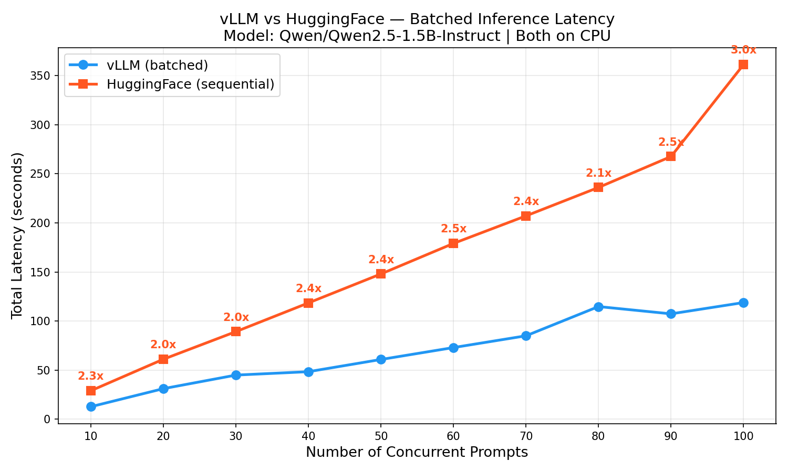

# surf predictor

Predicts surf quality at Ocean Beach, SF by feeding live NOAA buoy data + Surfline historical ratings into a small LLM (Qwen 2.5 1.5B) served via vLLM.

Also includes a benchmark comparing vLLM vs HuggingFace transformers for batched inference.

## setup

```bash
python -m venv .env
source .env/bin/activate
pip install -r requirements.txt
```

## usage

### surf predictions

```bash
# predict next 12 hours (default)
python surf_predictor.py

# predict next 6 hours
python surf_predictor.py --hours 6

# use huggingface instead of vllm
python surf_predictor.py --hours 6 --backend huggingface
```

Outputs a table comparing the LLM's predicted wave quality and wave height against Surfline's forecasts, hour by hour.

### benchmark

```bash
# default batch sizes (1, 2, 4, 8, 16)
python benchmark.py

# custom range
python benchmark.py --sizes 10 20 30 40 50 60 70 80 90 100

# custom output file
python benchmark.py --output my_plot.png
```

## vLLM vs HuggingFace



vLLM batches all prompts together and processes them concurrently through the model — shared KV cache, shared forward passes. HuggingFace transformers just loops through prompts one at a time. At 100 concurrent prompts on CPU, vLLM is ~3x faster. The gap widens as batch size grows.
